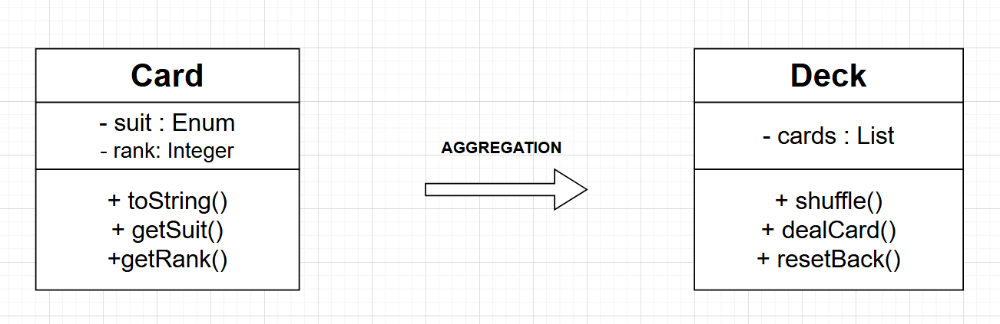
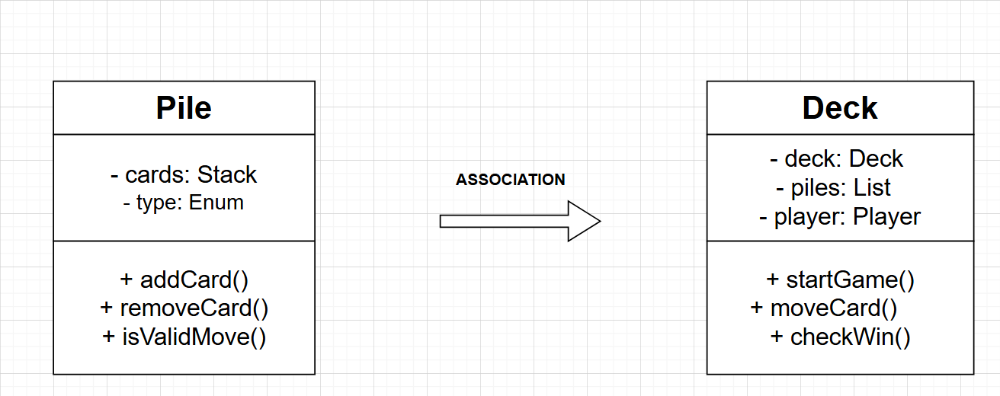
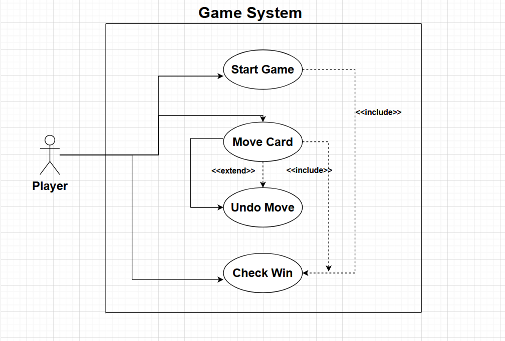
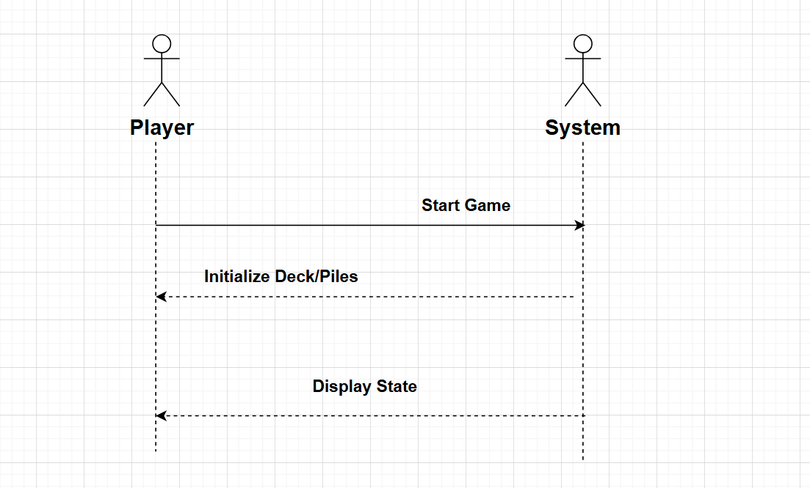
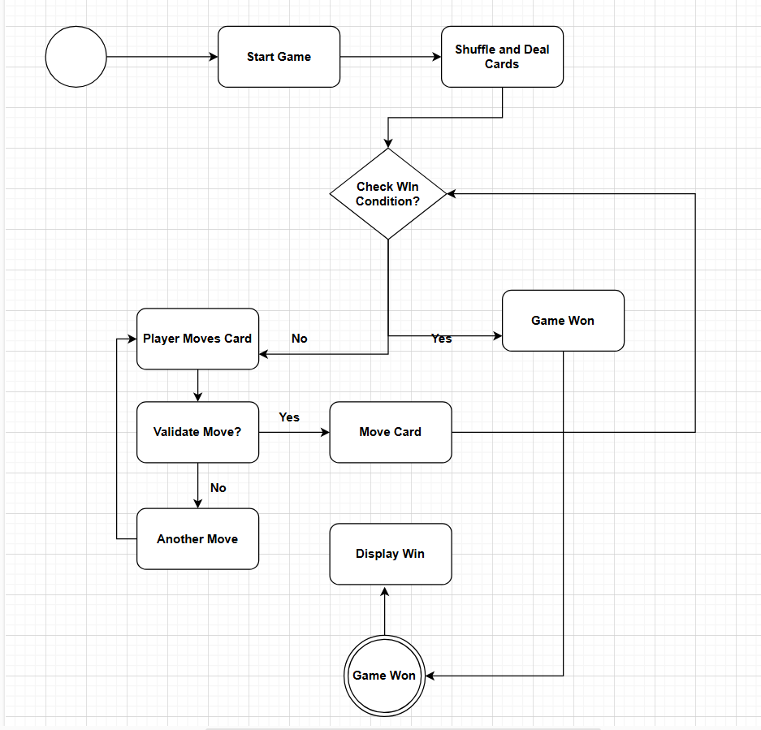

# Solitaire Game (Partial Implementation)

## 📌 Description
This project is a **partial implementation** of a **Solitaire** game in **C++**. The implementation includes:
- A `Card` class that represents individual playing cards.
- A `Deck` class for creating, shuffling, and dealing cards.
- A `main.cpp` file to test basic functionality.
- A `test_card.cpp` file for **unit testing** the `Card` class.
- **UML Diagrams** explaining the software design.

This implementation is built for a **GNU/Linux environment** but also works on **Windows (MinGW) and VS Code**.

---

## 📂 Project Structure
```bash
solitaire_project/
├── src/                # Source files
│   ├── card.h          # Card class header file
│   ├── card.cpp        # Card class implementation
│   ├── deck.h          # Deck class header file
│   ├── deck.cpp        # Deck class implementation
│   ├── main.cpp        # Main program
│   ├── test_card.cpp   # Unit test for Card class
│
├── diagrams/           # UML Diagrams
│   ├── class_diagram.png
│   ├── use_case_diagram.png
│   ├── sequence_diagram.png
│   ├── activity_diagram.png
│
├── README.md           # Project documentation (this file)
├── LICENSE             # MIT/GPL License
└── Solitaire Game Documentation.pdf  # Detailed documentation

```

## 📌 UML Diagrams
This project includes the following **UML Diagrams**:

### **1️⃣ Class Diagram**
This diagram shows the **structure** of the game classes and their relationships.



### **2️⃣ Use Case Diagram**
Illustrates how the **player interacts** with the system.


### **3️⃣ Sequence Diagram**
Represents the **flow of function calls** when the game starts.


### **4️⃣ Activity Diagram**
Shows the **decision flow** for game logic.


---

## ⚙️ Build & Run Instructions

### ✅ **Compile and Run Main Program**
For **Linux/macOS**:
```bash
cd src
g++ card.cpp deck.cpp main.cpp -o solitaire
./solitaire
```
For Windows:
```bash
cd src
g++ card.cpp deck.cpp main.cpp -o solitaire.exe
./solitaire.exe
```
